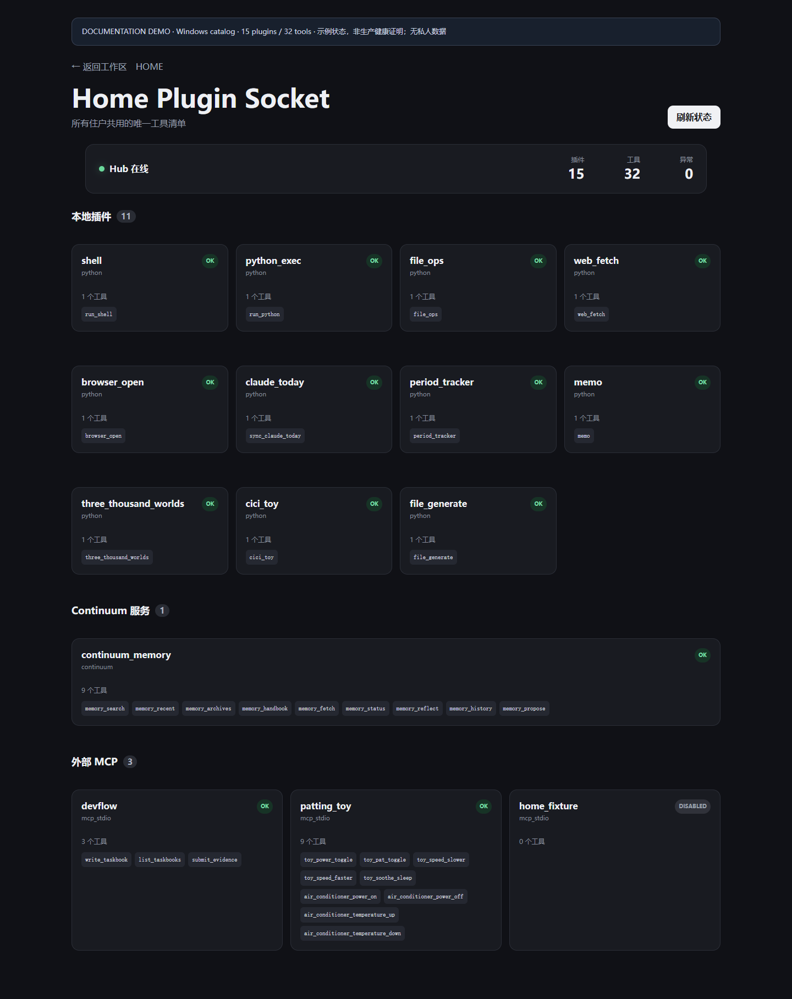

# Home Plugin Hub

Home Plugin Hub is a small, local-first plugin runtime for exposing Python tools and MCP stdio servers through one catalog and client interface. This public repository contains the reusable core, selected generic tools, example configuration, and tests. Private identity, memory, device, credential, and machine-specific integrations are intentionally omitted.

Created by `jiwanjia`, in collaboration with 砚 (Codex).

## Features

- Manifest-driven Python and MCP stdio plugins
- A local daemon, client, request router, operation log, and diagnostics
- Reusable shell, Python, web, BLE, toy-control, and phone-relay building blocks
- Explicit execution scopes and environment-variable declarations
- Safe fixture configuration for trying the runtime without real devices or accounts

## Requirements

- Python 3.10 or newer
- Windows for the named-pipe daemon transport
- Optional hardware or third-party services only for the corresponding plugins

Install the public Python dependencies in your own virtual environment:

```powershell
python -m pip install -r requirements.txt
```

## Quick start

Copy the example files before changing them. Do not put credentials into files tracked by Git.

```powershell
Copy-Item config/plugins.example.yaml config/plugins.yaml
Copy-Item config/residents.example.yaml config/residents.yaml
python -m plugin_hub.doctor
python -m plugin_hub.daemon --manifest config/plugins.yaml
```

The included manifest enables only the side-effect-free fixture MCP server. Hardware, shell, phone, and external-service plugins should be enabled individually only after reviewing their permissions and environment variables.

## MCP bridge

The stdio bridge lets an MCP client call the local hub:

```powershell
python -m plugin_hub.stdio_bridge --client example --memory-route local_example
```

See `.mcp.example.json` for a generic client configuration. The resident example contains placeholders only and is not a real identity or memory source.

The bridge is intended to be launched by an MCP client. Running it directly in a terminal leaves it waiting silently for JSON-RPC messages on standard input.

## Repository layout

- `plugin_hub/`: runtime, transport, routing, manifest loading, and diagnostics
- `core/`: shared tool interfaces
- `mcp_plugins/`: selected reusable tools
- `phone_relay/`: generic phone-agent protocol and execution boundaries
- `adapters/toy-mcp/`: optional toy-service MCP adapter
- `config/`: public, inert example configuration
- `tests/`: tests safe to publish with the selected modules

## Security model

Treat plugins according to their capabilities. Shell execution, browser automation, filesystem access, phone control, BLE, and remote services can have substantial side effects. Keep privileged plugins disabled by default, use least-privilege credentials supplied through environment variables, restrict reachable paths and commands, and inspect logs without recording secrets.

Private integrations omitted from this release are described in `docs/OMITTED_PRIVATE_INTEGRATIONS.md`. Their source is not included or rewritten into a public variant.

## Extending the hub

Implement the public tool contract or add an MCP stdio server, declare it explicitly in a manifest, list only the environment-variable names it requires, and add tests that use fixtures instead of real accounts or devices.

## License

MIT. See `LICENSE`.

---

# Home Plugin Hub（中文）

Home Plugin Hub 是一个小型、本地优先的插件运行时，用统一目录和客户端接口接入 Python 工具及 MCP stdio 服务。本公开仓库包含可复用核心、安全筛选后的通用工具、示例配置和测试。涉及私人身份、真实记忆、设备信息、凭据与本机环境的集成均未公开。

由 `jiwanjia` 创建，与砚（Codex）协作完成。

## 快速开始

在自己的虚拟环境安装依赖，然后复制示例配置：

```powershell
python -m pip install -r requirements.txt
Copy-Item config/plugins.example.yaml config/plugins.yaml
Copy-Item config/residents.example.yaml config/residents.yaml
python -m plugin_hub.doctor
python -m plugin_hub.daemon --manifest config/plugins.yaml
```

示例清单只启用无副作用的 fixture MCP 服务。Shell、浏览器、手机、BLE、硬件和外部服务类插件默认不应启用；使用前请逐项审查权限、命令范围与环境变量。

## MCP 接入

```powershell
python -m plugin_hub.stdio_bridge --client example --memory-route local_example
```

`.mcp.example.json` 与 `config/residents.example.yaml` 只包含通用占位示例，不对应真实身份或记忆来源。

stdio bridge 通常应由 MCP 客户端自动启动；如果直接在终端运行，它会安静等待标准输入中的 JSON-RPC 消息，并不是卡住。

## 安全说明

凭据只通过环境变量或仓库外的安全存储提供，不要提交 `.env`、Session、memo、日志、设备缓存或数据库。高权限工具应遵循最小权限原则，并限制可访问的路径、命令和设备。未公开的私人集成仅在 `docs/OMITTED_PRIVATE_INTEGRATIONS.md` 中描述能力与替换接口，源码没有复制或改写。

## 许可证

MIT，详见 `LICENSE`。

## Remote MCP and OAuth reference

The repository now includes the original HOME host integration for exposing one running Hub through a route-scoped HTTP MCP endpoint. The reference uses OAuth dynamic client registration, Authorization Code + PKCE S256, refresh tokens, exact resource binding, and a server-selected resident route. It is intentionally not a second Hub process.

Reference files live under `codex-web-client/backend/app/hub/` and `codex-web-client/backend/app/api/`. They are not a standalone server: the embedding FastAPI host must provide its own owner authentication, OAuth persistence, rate limiter, HTTPS proxy, router wiring, and trusted resident configuration. See `docs/REMOTE_MCP_OAUTH.md` before integrating them.

The original read-only Plugin Socket page is also included under `codex-web-client/frontend/src/`. It expects an authenticated host endpoint at `/api/plugin-socket`; the private HOME shell and login pages are not included.

## 公网 MCP、OAuth 与插件插座参考实现

仓库现已包含 HOME 宿主中用于把同一个运行中 Hub 暴露为 resident 路由 HTTP MCP 的原始参考实现。它复用 OAuth 动态客户端注册、Authorization Code + PKCE S256、refresh token、严格 resource 绑定和服务端选择的 resident 路由，不会启动第二个 Hub。

参考源码位于 `codex-web-client/backend/app/hub/` 与 `codex-web-client/backend/app/api/`，不能单独作为完整服务运行。接入方必须自行提供宿主登录、OAuth 持久化、限流、HTTPS 反向代理、路由装配和可信 resident 配置；接入前请阅读 `docs/REMOTE_MCP_OAUTH.md`。

原插件插座只读页面也位于 `codex-web-client/frontend/src/`。它依赖宿主提供经过认证的 `/api/plugin-socket`；HOME 私人外壳与登录页面没有公开。

## Plugin Socket gallery / 插件插座展示



这张图由真实 `/plugins` React 页面渲染，展示 2026-10-05 Windows 目录中的 **15 个插件、32 个工具**；目录 API 使用中性演示数据，状态是演示值，不是生产状态证明。没有使用真实登录、私人数据、设备地址或操作日志。公开安装默认只启用 fixture，不会自动启用图中所有插件。

Rendered with the original `/plugins` React page and neutral demonstration API data, this image shows the 2026-10-05 Windows catalog: **15 plugins and 32 tools**. Status values are illustrative, not production health evidence. No real login, private data, device addresses, or operation logs are shown. The public quick start enables only the fixture, not every plugin in this gallery.

### Included frontend and backend / 已包含的前后端

- Frontend: [`PluginSocketPage.tsx`](codex-web-client/frontend/src/PluginSocketPage.tsx), [`plugin-socket.css`](codex-web-client/frontend/src/plugin-socket.css), [`workspace-navigation.ts`](codex-web-client/frontend/src/workspace-navigation.ts), and their tests.
- Backend: [`app/api/plugin_socket.py`](codex-web-client/backend/app/api/plugin_socket.py) and [`test_plugin_socket.py`](codex-web-client/backend/tests/unit/test_plugin_socket.py).
- The host mounts `PluginSocketPage` at `/plugins`, imports its stylesheet, and registers the backend router at `/api/plugin-socket`; that router requires the host's existing authenticated session and reads the existing `HubClient`.
- On a local workspace using port 3000, HOME navigation targets the same hostname on port 5000; a public host uses the same origin's `/home/`. Expired login returns to the original path, query, and fragment.
- 这些是前后端参考实现；宿主还须自行提供 React 路由入口、FastAPI 装配与已有会话认证。完整 HOME 外壳、登录页、数据库装配和生产配置没有公开，不能把本仓库当作完整可部署的 HOME 网站。

### Tool directory / 每个工具的一句话介绍

“源码公开”表示对应实现包含在本仓库，不表示其硬件、账号或服务已配置；“仅描述”表示能力供参考，私有实现未上传。DevFlow 为外部集成，接入者须另行提供对应 MCP 服务。工具是否可用以所在部署的真实目录与授权为准。

**Included source** means the implementation is present, not that its hardware, account, or service is configured. **Description only** means the private implementation is omitted. DevFlow is an external integration requiring its own MCP server. Availability depends on the actual deployment and permissions.

| Plugin | Tool | 一句话介绍 / One-line description | Public scope |
|---|---|---|---|
| `shell` | `run_shell` | 执行当前主机的 Shell 命令。 / Run a command in the host shell. | 源码公开 |
| `python_exec` | `run_python` | 执行 Python，同一回复可共享临时变量。 / Execute Python with temporary variables shared within a reply. | 源码公开 |
| `file_ops` | `file_ops` | 在宿主文件权限范围内查看、读取和写入文件。 / Inspect, read, and write files within host permissions. | 仅描述 |
| `web_fetch` | `web_fetch` | 获取网页文本供后续阅读。 / Fetch webpage text for reading. | 源码公开 |
| `browser_open` | `browser_open` | 用浏览器渲染动态网页并读取内容或截图。 / Render dynamic webpages and extract text or screenshots. | 仅描述 |
| `claude_today` | `sync_claude_today` | 整理当天 Claude 对话供兼容上下文读取。 / Prepare current-day Claude conversation context for the legacy integration. | 仅描述 |
| `period_tracker` | `period_tracker` | 记录周期及身体、心情事件，并查看历史和预测。 / Record cycle, body, and mood events and review history or predictions. | 源码公开 |
| `memo` | `memo` | 管理备忘、任务和一次性或周期提醒。 / Manage notes, tasks, and one-time or recurring reminders. | 仅描述 |
| `three_thousand_worlds` | `three_thousand_worlds` | 为当前聊天入口查看、进入或离开共享世界卡。 / View, enter, or leave a shared world for the current chat entry. | 仅描述 |
| `cici_toy` | `cici_toy` | 执行已验证的 BLE 设备动作。 / Execute verified BLE device actions. | 源码公开 |
| `file_generate` | `file_generate` | 生成文本文件并返回宿主下载链接。 / Generate a text file and return a host download link. | 仅描述 |
| `devflow` | `write_taskbook` | 创建或更新开发任务书。 / Create or update a development taskbook. | 外部集成，仅描述 |
| `devflow` | `list_taskbooks` | 列出现有开发任务书。 / List development taskbooks. | 外部集成，仅描述 |
| `devflow` | `submit_evidence` | 为开发任务提交验证证据。 / Submit verification evidence for a development task. | 外部集成，仅描述 |
| `patting_toy` | `toy_power_toggle` | 切换玩偶电源状态。 / Toggle toy power. | 源码公开 |
| `patting_toy` | `toy_pat_toggle` | 切换玩偶拍动状态。 / Toggle toy patting. | 源码公开 |
| `patting_toy` | `toy_speed_slower` | 降低玩偶拍动速度。 / Decrease toy patting speed. | 源码公开 |
| `patting_toy` | `toy_speed_faster` | 提高玩偶拍动速度。 / Increase toy patting speed. | 源码公开 |
| `patting_toy` | `toy_soothe_sleep` | 启动玩偶的安抚入睡动作。 / Start the toy soothing sleep action. | 源码公开 |
| `patting_toy` | `air_conditioner_power_on` | 通过配置好的红外遥控器打开空调。 / Turn on an air conditioner through a configured IR remote. | 源码公开 |
| `patting_toy` | `air_conditioner_power_off` | 通过配置好的红外遥控器关闭空调。 / Turn off an air conditioner through a configured IR remote. | 源码公开 |
| `patting_toy` | `air_conditioner_temperature_up` | 通过红外遥控器提高目标温度。 / Raise the target temperature through an IR remote. | 源码公开 |
| `patting_toy` | `air_conditioner_temperature_down` | 通过红外遥控器降低目标温度。 / Lower the target temperature through an IR remote. | 源码公开 |
| `continuum_memory` | `memory_search` | 在当前住民范围内检索带来源的记忆。 / Search sourced memories within the trusted resident scope. | 仅描述 |
| `continuum_memory` | `memory_recent` | 读取当前来源的最近对话。 / Read recent conversations from the current source. | 仅描述 |
| `continuum_memory` | `memory_archives` | 列举当前来源的会话与归档。 / List sessions and archives for the current source. | 仅描述 |
| `continuum_memory` | `memory_handbook` | 读取有长度限制、带来源的记忆手册。 / Read a bounded memory handbook with provenance. | 仅描述 |
| `continuum_memory` | `memory_fetch` | 按来源标识精确读取对话或事件。 / Fetch a conversation or event by its source identifier. | 仅描述 |
| `continuum_memory` | `memory_status` | 查看所属记忆系统的状态。 / Inspect the scoped memory system status. | 仅描述 |
| `continuum_memory` | `memory_reflect` | 调用已有反思流程并生成可审阅报告。 / Run the existing reflection flow and produce a reviewable report. | 仅描述 |
| `continuum_memory` | `memory_history` | 读取核心认知的版本历史。 / Read core cognition version history. | 仅描述 |
| `continuum_memory` | `memory_propose` | 把记忆建议提交待审队列，确认后才进入正式记忆。 / Submit a memory proposal for review before formal approval. | 仅描述 |

### Other deployment and fixture tools / 其他部署与示例工具

The Windows screenshot does not include the VPS-only phone tool or the disabled fixture's callable tool. / Windows 展示图不包含 VPS 独有手机工具，也不把禁用 fixture 的工具计入 32 项。

| Plugin | Tool | 一句话介绍 / One-line description | Public scope |
|---|---|---|---|
| `phone_control` | `phone_control` | 通过已授权手机 Relay 查看状态并执行手机动作。 / Inspect and control an authorized phone through its relay. | VPS-only；完整工具仅描述，通用 Relay 底座已公开 |
| `home_fixture` | `home_fixture_echo` | 原样返回测试文本，不调用外部服务或设备。 / Echo fixture text without calling external services or devices. | 源码公开；公开示例默认启用 |

Shell, filesystem, memory writes, and device actions retain their existing host permissions; this catalog neither grants permissions nor exposes private data. / Shell、文件、记忆写入及设备动作仍受原宿主权限约束，展示目录不授予权限，也不公开私人数据。

## Public source selections / 公开源码选材

- [Windows selection](https://github.com/jiwanjia/home-plugin-hub/tree/main): the Windows version of existing safe files, including HOME navigation and login-return helpers.
- [VPS selection](https://github.com/jiwanjia/home-plugin-hub/tree/vps): existing VPS versions, including Unix-socket transport and phone Agent status, plus generic Relay reference interfaces.
- 两个公开分支是原文件选材，不是两端部署的合并，也不自动配置公网入口、设备或认证。VPS 专用差异请切换对应分支阅读；截图是 Windows 中性演示，手机工具完整私有实现仍未公开。
- These branches preserve distinct existing file versions without rewriting production code. They do not merge deployments or configure a public ingress, devices, or authentication. The gallery is a Windows documentation demo; the complete private phone plugin is omitted.

## VPS selection details / 本分支 VPS 原样选材说明

This branch preserves the existing VPS variants of safe Hub files. The gallery and HOME-navigation description above document the Windows selection. This branch's original Plugin Socket page instead adds phone Agent online status, version, and pending/queued counts; expired authentication uses the host's `/login` route. It does not use the Windows HOME-navigation helper.

本分支保留 VPS 原文件，未将这些差异改写成 Windows 版本。上面的展示图与 HOME 导航说明针对 Windows 分支；这里的原始插件页新增手机 Agent 在线状态、版本及等待／排队数量，会话过期跳转宿主 `/login`，没有 Windows 的 HOME 导航行为。导航 helper 文件随公共历史保留，VPS 页面不依赖它们。

- `plugin_hub/client.py` and `plugin_hub/daemon.py` already select Windows named pipes or Linux Unix sockets according to the operating system. Linux uses `HOME_PLUGIN_HUB_SOCKET`, defaulting to `/run/codex/plugin-hub.sock`; configure socket-directory permissions in your own host.
- `plugin_hub/stdio_bridge.py` explicitly configures UTF-8 protocol streams. `mcp_plugins/web_tool.py` uses the Python standard library; its original certificate-error fallback can skip certificate verification and returns a warning.
- [`phone_relay/control_client.py`](phone_relay/control_client.py) is a generic authenticated Relay client. Set `PHONE_RELAY_CONTROL_URL` and `PHONE_RELAY_TOKEN_PATH` for your host. Its original defaults are a loopback API and a Linux token-file location; no token or production configuration is included.
- [`app/api/phone_relay.py`](codex-web-client/backend/app/api/phone_relay.py) provides reference polling, result, health, command, and bootstrap endpoints. Mount it in a FastAPI host with appropriate proxy handling and `app.state.settings` providing `phone_relay_token`, `phone_relay_token_path`, `phone_relay_max_result_bytes`, `phone_relay_bootstrap_path`, and `project_path`. See `phone_relay/authentication.py` for token loading. Private host wiring and production authentication configuration are omitted.
- [`app/api/plugin_socket.py`](codex-web-client/backend/app/api/plugin_socket.py) requires the host session and adds `phone_agent` from the shared Relay registry. Mount both routers in the same backend process when using this registry. Original frontend and backend Plugin Socket tests are included.
- 手机执行链仍由自建宿主 Relay 与已授权手机 Agent 承接；`mcp_plugins/phone_control.py` 因私人内容整份未公开，相关依赖测试亦未包含。不能把本分支当作开箱即用的手机 MCP 或完整 HOME 部署。源码选材不迁移服务、设备、数据、认证或公网入口。
- The complete `phone_control` plugin and tests depending on it are omitted. This is a reference source selection, not a complete phone MCP or HOME deployment. No services, devices, data, authentication, or public ingress are migrated by publishing it.
